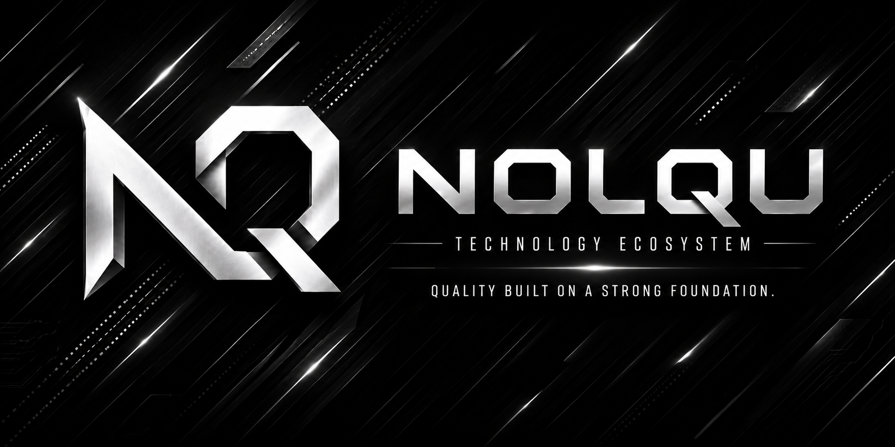

# NolQu Ecosystem

  

  <b>Quality built on a strong foundation.</b>

---

## 👋 About Me

### Hi, I'm Nadzil.

I'm a developer and the creator of the **NolQu Ecosystem**, an independent technology ecosystem focused on programming languages, systems, software, and developer technologies.

I enjoy exploring how software works—from high-level concepts down to the machine level—and building technologies around that understanding.

---

## 🌐 What is NolQu?

**NolQu is a technology ecosystem — not a single project.**

The ecosystem is designed to bring together multiple technologies that can complement each other, ranging from programming languages and compilers to operating systems, system components, and developer tools.

The goal is to build these technologies on a strong and consistent foundation while allowing each component to have its own purpose.

---

## 🚧 Development

The **NolQu Ecosystem is currently under active development.**

**Official Organization**  
https://github.com/NolquDev

**My GitHub**  
https://github.com/Nadzil123

---

## 👤 Creator

**Nadzil**

Creator and maintainer of the **NolQu Ecosystem**.

---

  <b>NolQu — Quality built on a strong foundation.</b>

